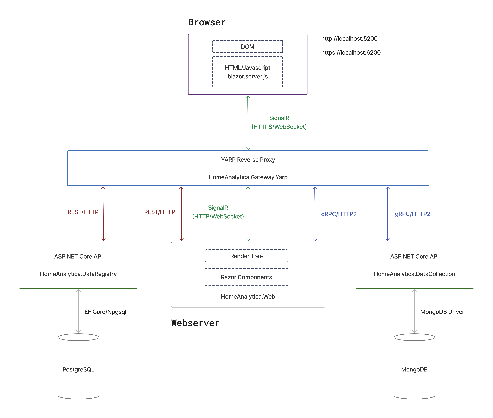

# ASP.NET Core Microservices Integration Sample



## Screenshots

Check out the [screenshots](./screenshots.md) for a visual overview.

## Project Overview

**HomeAnalytica** is a sample application developed to demonstrate the integration of ASP.NET Core technologies in a microservices-based architecture. 
The project highlights the technical interplay between Blazor, YARP (Yet Another Reverse Proxy), and microservices using REST/HTTP and gRPC.  
This application is a demonstration project, primarily highlighting the backend architecture and the communication between the Blazor server and the microservices.  

In the UI, users can create sensor devices, which are sent to a PostgreSQL database via REST/HTTP. Additionally, sample data (e.g., temperature, humidity, and energy usage) can be submitted via gRPC to a MongoDB database. These data points are visualized through line and bar charts.

**Note:**
Future updates will primarily focus on refactoring efforts, such as addressing compiler warnings and improving code comments. See the [TODO List](#todo-list) for planned updates and improvements.  
This code is intended for demonstration purposes only and is not suitable for production use. Sensitive information, such as secrets and credentials, should be stored securely using a dedicated key management solution or secret store.

The solution is divided into multiple projects to simulate key functionalities within an IoT data analytics platform:

### Key Components

1. **HomeAnalytica.Web (Blazor Web App)**  
    A Blazor Web App that provides a user-friendly interface for managing sensor devices and viewing sample sensor data. The UI is designed with simplicity in mind, allowing the focus to remain on backend and architectural functionality.  
    Apex Charts was integrated for creating interactive charts. See also https://apexcharts.github.io/Blazor-ApexCharts/

2. **HomeAnalytica.Gateway.Yarp (Reverse Proxy)**
   - Acts as a reverse proxy to route requests between the Blazor frontend and backend microservices, enabling efficient load distribution and separation of concerns.

3. **HomeAnalytica.Grpc.Contracts (Protobuf Definitions)**
   - A library containing Protobuf definitions for gRPC communication between the Blazor Web App and the Data Collection microservice.

4. **HomeAnalytica.DataRegistry (Data Registry Microservice)**
   - Provides services to facilitate access to PostgreSQL tables, which store data about sensor devices and physical units/measurements. These include sensor data and measurement units such as temperature, energy consumption, and humidity.
   - It utilizes **HomeAnalytica.DataRegistry.Data** for interacting with the PostgreSQL database.
   - The service is responsible for applying database migrations and seeding initial data using a Code First approach. It initializes necessary tables and inserts predefined values for physical units (e.g., Celsius, Fahrenheit, kWh) and measured quantities (e.g., Temperature, Humidity, Energy Consumption).

5. **HomeAnalytica.DataCollection (Data Collection Microservice)**
   - API to collect and store sample data, such as temperature, humidity, and energy consumption. The data is manually entered by users in the Blazor frontend.  
   - It utilizes **HomeAnalytica.DataCollection.Data** for interacting with the MongoDB database.

6. **HomeAnalytica.DataRegistry.Data (Data Access - PostgreSQL)**
   - Implements the data access layer for interacting with the PostgreSQL database using Entity Framework Core.  
   This layer handles the connection to the PostgreSQL database and enables efficient querying, insertion, and management of data.
   - Utilizes the Unit of Work and Repository pattern to ensure maintainable, testable, and efficient data access operations. These patterns help decouple business logic from data access logic, making the system more modular and easier to maintain.

1. **HomeAnalytica.DataCollection.Data (Data Access - MongoDB)**
   - Provides the data access layer for interacting with MongoDB collections, leveraging the MongoDB driver for .NET. This layer facilitates operations like inserting and retrieving sensor data from MongoDB.
   - Includes services such as the `DatabaseInitializationService`, which ensures the proper initialization of the database, including the creation of necessary indexes for collections to optimize query performance.
   - Also implements the repository pattern, with a base class for sensor data repositories (`SensorDataRepository<T>`), which handles CRUD operations and allows for easy interaction with the MongoDB collections for different types of sensor data (e.g., temperature, humidity, energy consumption).

## Prerequisites

- [.NET 9 SDK](https://dotnet.microsoft.com/download/dotnet/9.0)
- [Visual Studio 2022](https://visualstudio.microsoft.com/vs/) or [Visual Studio Code](https://code.visualstudio.com/)
- [Docker](https://www.docker.com/) (optional, for containerization)

## Setting up the HTTPS Certificates (Windows)

### 1. Visual Studio

When debugging the Blazor Web App (`HomeAnalytica.Web`) in Visual Studio, the HTTPS certificate is automatically generated and trusted for local development. You don’t need to manually set up the certificate for Visual Studio; it handles the HTTPS configuration for you.

If you encounter any issues or need to manually trust the certificate, you can run the following commands:

```bash
dotnet dev-certs https --trust
```

### 2. Docker

To run the Docker container with HTTPS support for `HomeAnalytica.Web` (the Blazor Web App), please create the following SSL certificates and trust them by following these steps:

```bash
dotnet dev-certs https
dotnet dev-certs https -ep %APPDATA%\ASP.NET\Https\HomeAnalytica.Web.pfx -p 8517c5bc-614d-49b7-8990-ff40578db4a5
dotnet dev-certs https --trust
```

## Getting Started

### Option 1: Start the Application with dotnet Commands

1. Clone the repository:

    ```bash
    git clone https://github.com/jasdvl/sample-aspnetcore-microservices.git
    ```

2. Navigate to the project directory:

    ```bash
    cd sample-aspnetcore-microservices\src
    ```

3. Restore dependencies:

    ```bash
    dotnet restore HomeAnalytica.sln
    ```

4. Build

    ```bash
    dotnet build HomeAnalytica.sln
    ```

5. Start the database services:

    ```
    docker-compose up -d homeanalytica.dataregistry.db homeanalytica.datacollection.db
    ```

6. Run the applications:

    ```bat
    start dotnet run --project HomeAnalytica.Gateway.Yarp/HomeAnalytica.Gateway.Yarp.csproj
    start dotnet run --project HomeAnalytica.DataRegistry/HomeAnalytica.DataRegistry.csproj
    start dotnet run --project HomeAnalytica.DataCollection/HomeAnalytica.DataCollection.csproj
    start dotnet run --project HomeAnalytica.Web/HomeAnalytica.Web.csproj
    ```

7. Access the Application:

   After starting the application, you can access it in your browser at the following URLs:

   - HTTP: [http://localhost:5200](http://localhost:5200)
   - HTTPS: [https://localhost:6200](https://localhost:6200)

   You can choose either URL depending on your preferred connection type (HTTP or HTTPS).

### Option 2: Start All Services with Docker Compose

1. Clone the repository if you haven’t already:

    ```
    git clone https://github.com/jasdvl/sample-aspnetcore-microservices.git
    ```

2. Navigate to the project directory:

    ```
    cd sample-aspnetcore-microservices/src
    ```

3. Start all services (database and microservices) with Docker Compose:

    ```
    docker-compose up --build -d
    ```

    This will build and start all services defined in the docker-compose.yml file, including the database and all microservices.

4. After starting the application, you can access it in your browser at the following URLs:

   - HTTP: [http://localhost:5200](http://localhost:5200)
   - HTTPS: [https://localhost:6200](https://localhost:6200)

    You can choose either URL depending on your preferred connection type (HTTP or HTTPS).

## TODO List

- Fix compiler warnings
- Add comments where they are still missing

## Branching Strategy

Since I am the sole developer on this project, I primarily work on the `main` branch. I prefer to keep things simple by committing directly to `main` for most tasks. However, if a new feature requires multiple related commits or substantial changes, I will create feature branches to manage those updates. Once the feature is complete, the branch will be merged back into `main`. My goal is to keep the main branch stable and up to date.
